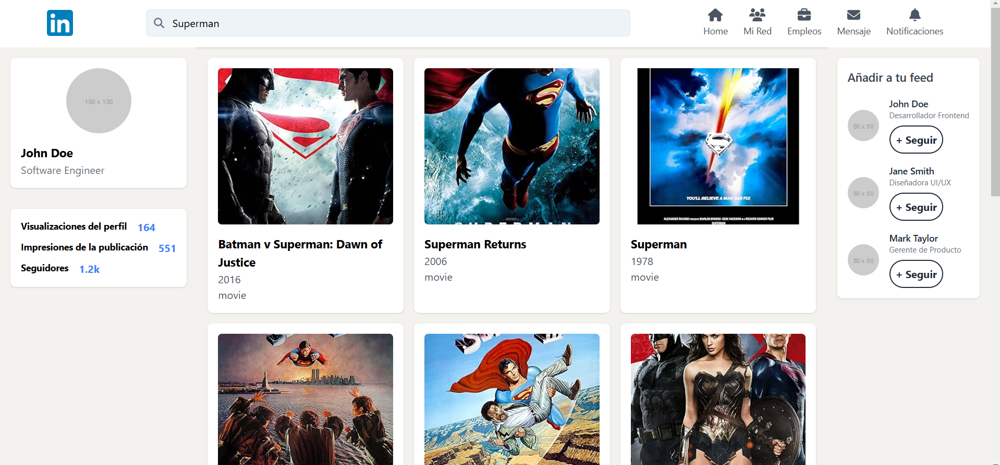
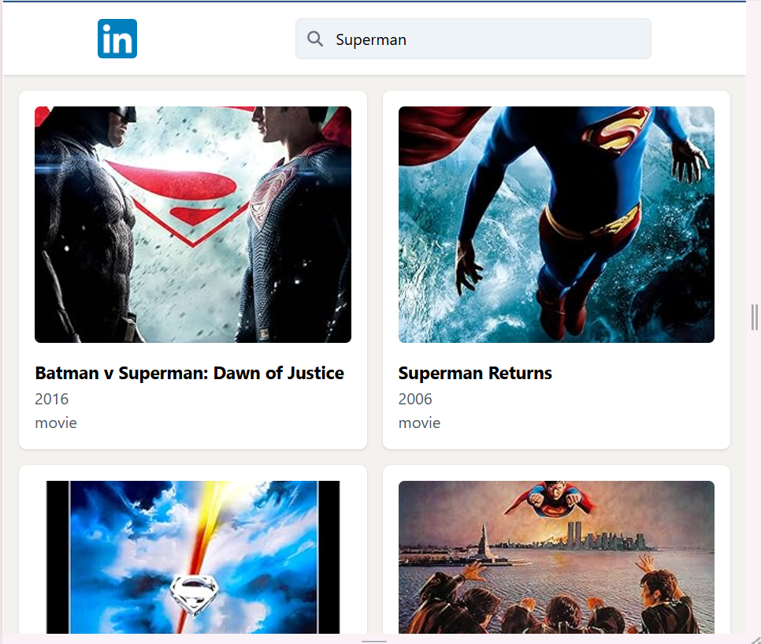

# LinkedIn Home Clone with Movie Search Feature

This project is a recreation of the LinkedIn home page structure, integrating a movie search feature using the OMDb API. It is built with React, Tailwind CSS, and React Query, following best practices for modern web development.

## Table of Contents

- [Features](#features)
- [Technologies](#technologies)
- [Screenshots](#screenshots)
- [Getting Started](#getting-started)
- [Environment Variables](#environment-variables)
- [Running Locally](#running-locally)
- [Additional Features](#additional-features)
- [Deployed Application](#deployed-application)

---

## Features

- **LinkedIn-like layout**: Includes a header, sidebar, main content area, and optional footer.
- **Movie Search**: Fetch movie data from the OMDb API.
  - Displays movie title, poster, and a brief description.
  - Includes a search bar to find specific movies.
- **Pagination**: Browse through pages of movie results.
- **Responsive Design**: Optimized for both desktop and mobile devices.
- **Error Handling**: Displays error messages when API calls fail.
- **Secure API Integration**: Uses environment variables to securely store API keys.

---

## Technologies

- **Frontend**: React, Tailwind CSS, React Query, React Router.
- **State Management**: React Query
- **API**: OMDb API.
- **Build Tool**: Vite.

---

## Screenshots

### Desktop View

### Mobile View

---

## Getting Started

### Prerequisites

- Node.js (version 16 or above).
- npm or yarn.
- npm run install
- npm run dev

## Environment Variables

Create a `.env` file in the root directory and add the following:
